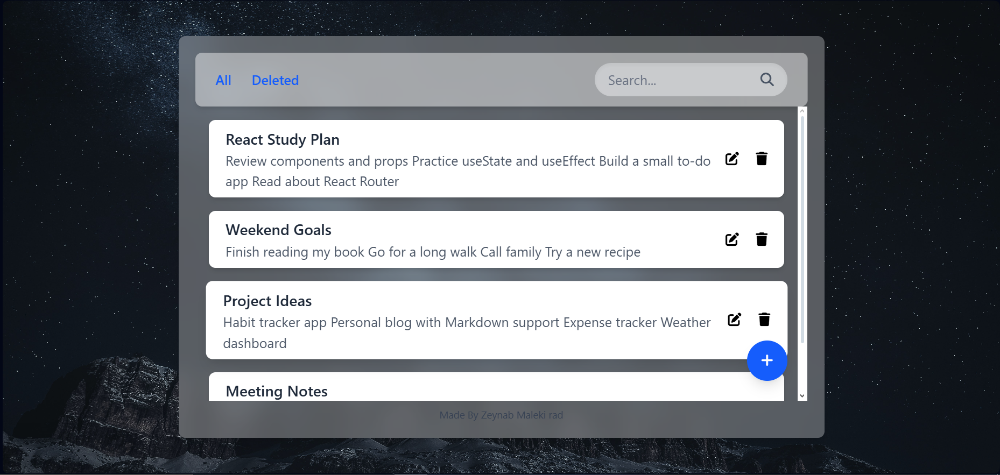
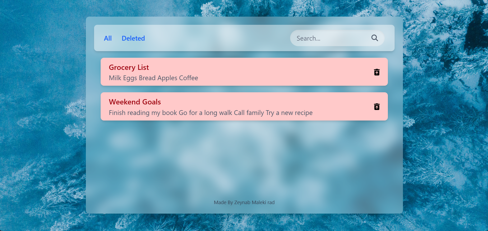
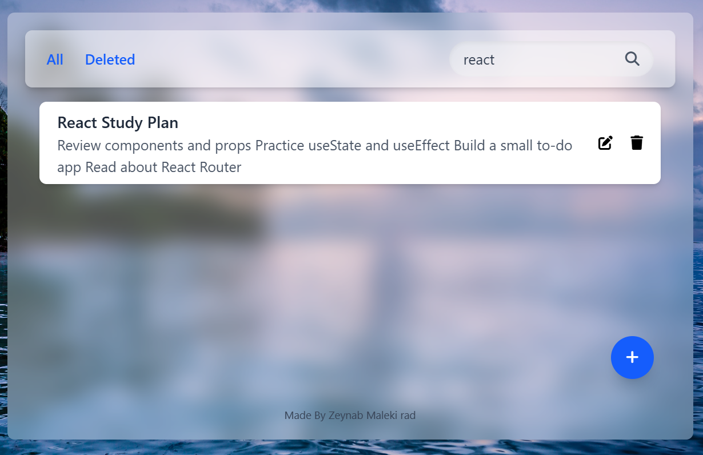
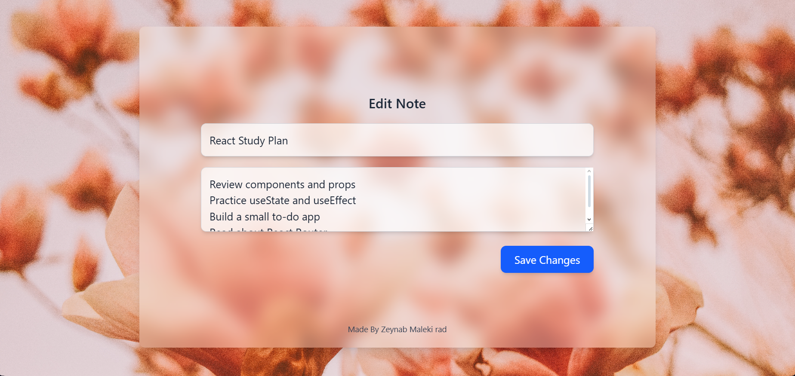

# 📝 Notes With React

Welcome to **Notes With React**!  
A simple, beautiful, and fast note-taking app built with React.  
Take notes, edit, delete, and restore them with ease! 🌟

---

## ✨ Features

- 🖊️ **Add Notes** — Quickly jot down your thoughts.
- ✏️ **Edit Notes** — Update your notes anytime.
- 🗑️ **Delete & Restore** — Accidentally deleted? Restore from the deleted notes section!
- 🔍 **Search** — Instantly find notes by title or content.
- 🎨 **Beautiful UI** — Clean, modern design with a changing background.
- 💾 **Local Storage** — Your notes stay safe in your browser.

---

## 🚀 Getting Started

1. **Clone the repo**
    ```bash
    git clone https://github.com/your-username/notes-with-react.git
    cd notes-with-react
    ```

2. **Install dependencies**
    ```bash
    npm install
    ```

3. **Run the app**
    ```bash
    npm run dev
    ```
    Open [http://localhost:5173](http://localhost:5173) in your browser.

---

## 📸 Screenshots

| Main Page | Deleted Notes | Search Note | Edit Note |
|-----------|---------------|--------------|--------------|
|  |  |  | |

---

## 🛠️ Tech Stack

- [React](https://react.dev/)
- [Vite](https://vitejs.dev/)
- [Tailwind CSS](https://tailwindcss.com/)
- [Font Awesome](https://fontawesome.com/)

---

## 🙋‍♀️ Author

Made with ❤️ by **Zeynab Malekirad**

---

## 📃 License

This project is open source and available under the MIT License.
